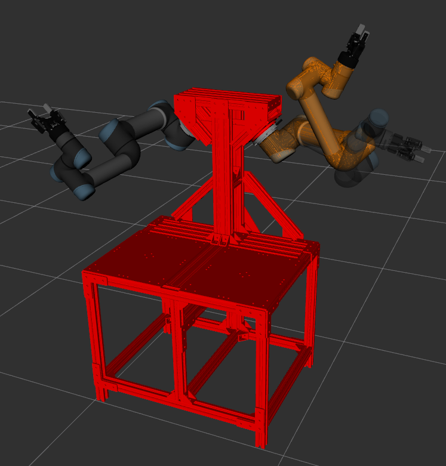

# DAURAR (Dual-Arm-Univeral-Robot5-Augmented-Reality)
### This repo is the ROS component for the DAURAR project for the Dual-Arm UR5 manipulators in the MuLIP lab at Tufts University.



## Installation 

```
cd ~/catkin_ws/src
git clone https://github.com/DreVinciCode/ROS_DAURAR.git
git clone https://github.com/DreVinciCode/universal_robot.git
git clone https://github.com/DreVinciCode/Universal_Robots_ROS_Driver.git
git clone https://github.com/DreVinciCode/robotiq_85_gripper.git 


cd ..
rosdep install --from-paths src --ignore-src -r -y

```

## Requirements
1. Ubuntu 18.04
2. ROS Melodic
3. Gazebo
